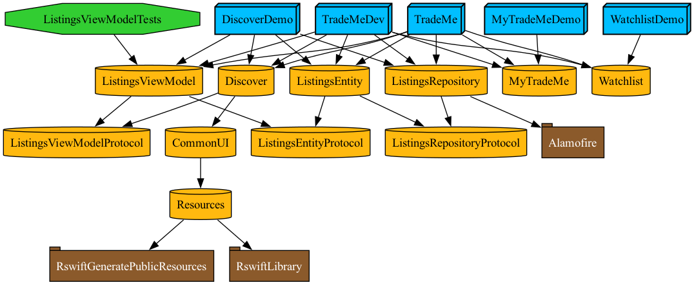

  

# Trade Me Mobile Technical Test For Seinor iOS Developer role, Bonsung Koo

## Project Dependency Graph

## Require external dependency to create a project.
- [Tuist](https://tuist.dev)

> Visit [How to Install](https://docs.tuist.dev/en/guides/quick-start/install-tuist)

And that's all.

## Project managing by Tuist.
1. `tuist generate`
- This command will generate `TradeMe.xcworkspace` file.
- You also can use options. For example:
  - `tuist generate DiscoverDemo`: This will generate a project containing only targets related to the `Discover` App.
  - `tuist generate Discover`: This will generate a project containing only the `Discover` UI components. This can help speed up UI development as it will only build the necessary components.

2. `tuist edit`
- This command can be used when you want to manage modules.

3. `tuist graph`
- This command will generate a dependency graph.
- You can also use options, similar to the `tuist generate` examples.

## Comments
Kia ora Trade Me tream,

I am truly grateful for this precious opportunity.
Although I did my best within the 4-hour time limit, I would like to briefly note what I regret and where I fell short.

1. I couldn't implement `AuthRepsitory`
- I was planning to create an `AuthRepository` that would be injected into other repositories.
- This was important for encapsulation and separation of concerns.

2. I couldn't write Test code
- This was not part of the acceptance criteria; however, I wanted to go a bit further.

3. I couldn't finish configuring the `Dev` and `Production` environments
- I was planning to create a `Factory` module to inject dependencies into features. Although I created the modules, there wasn't enough time to complete the implementation.

I was happy and excited to do this exercise.

I hope this submission effectively displays my knowledge and experience.

Thank you for your time and considersation.

Bonsung.